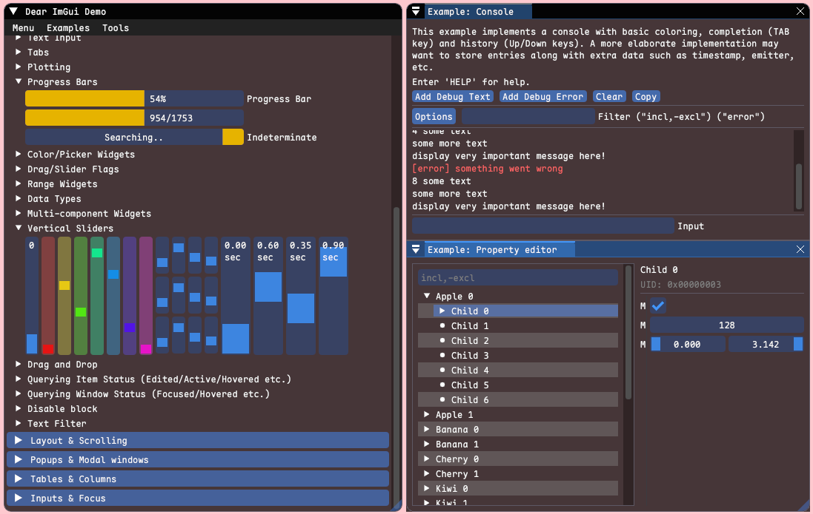
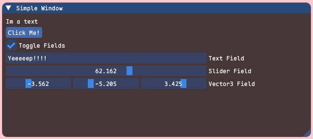

# UB imgui


<br/>

Install from [Package Manager:](https://docs.unity3d.com/Manual/upm-ui-giturl.html)
```
https://github.com/MasterSix997/UBImGui.git
```
## Description
UB ImGui is an integration between "Unity" and [Dear ImGui](https://github.com/ocornut/imgui), without resource bloat, making it easy to modify and extend <br/>
Using the binds provided by [ImGui.Net](https://github.com/ImGuiNET/ImGui.NET) which in turn uses the binds from [cimgui](https://github.com/cimgui/cimgui).
And some code snippets from the archived [dear-imgui-unity](https://github.com/realgamessoftware/dear-imgui-unity)<br/>

## Note
> **`No initial configuration is required`, not even prefabs, or render pipeline passes.<br/>**
> Everything starts automatically, but you can configure some features in "Edit/Project Settings/UB ImGui"

## Features
- Unity Versions 
  - ✅ Unity 2022
  - ✅ Unity 6
- Platforms
  - ✅ Windows
  - ✅ Linux
  - ✅ MacOS
  - 🟨 Android (can render normally, but touch input needs to be implemented)
  - ❌ WebGL (how run a "dll" in WebGL?)
- ✅ Docking
- ✅ Textures
- ✅ BuiltIn Support
- ✅ URP Support
- ✅ HDRP Support
- ✅ Render In Front (**With Coroutine**)
- ✅ IL2CPP
- ✅ Input Manager
- ✅ Input System
- ✅ Custom Fonts
- ✅ Custom Cursors
- 🟨 FreeType (It's possible to implement, but needs a way to build for Mac and Linux)
- 🟨 GUI Scale with DPI or resolution (Currently need to scale manually)

> ✅ - Implemented<br/>
> 🟨 - Not implemented, but to be done<br/>
> ❌ - Not implemented, and will not be implemented<br/>
 
## Samples
### Demo Window
A demo Window with several usage examples<br/>
[Available online in web](https://pthom.github.io/imgui_manual_online/manual/imgui_manual.html)

```csharp
using ImGuiNET;
using UnityEngine;

public class ShowDemoWindow : MonoBehaviour
{
    private void OnEnable()
    {
        ImGui.Layout += OnLayout;
    }
    
    private void OnDisable()
    {
        ImGui.Layout -= OnLayout;
    }

    private void OnLayout()
    {
        ImGui.ShowDemoWindow();
    }
}
```
<h1 align="center">
<a href="#"></a>
<br />
</h1>

### Simple Window

```csharp
using ImGuiNET;
using UnityEngine;

public class SimpleWindow : MonoBehaviour
{
    private void OnEnable()
    {
        ImGui.Layout += OnLayout;
    }

    private void OnDisable()
    {
        ImGui.Layout -= OnLayout;
    }

    // Fields to be used in the window
    private bool enableFields;
    // As this string is not serialized (public or [SerializeField]), it is necessary to initialize it before using
    private string textValue = "";
    private float sliderValue;
    private Vector3 vector3Value;
    
    private void OnLayout()
    {
        // Begin a new window called "Simple Window"
        // If the window is collapsed, there is no need to create widgets (no need to call ImGui.End())
        if (ImGui.Begin("Simple Window"))
        {
            // Add some text to the window
            ImGui.Text("Im a text");
            
            // If the button is clicked, log a message to the console
            if (ImGui.Button("Click Me!"))
            {
                Debug.Log("Thanks :)");
            }

            // Add a checkbox to enable/disable fields
            ImGui.Checkbox("Toggle Fields", ref enableFields);

            // If fields are enabled, add widgets
            if (enableFields)
            {
                // Add input fields for text, slider, and vector3
                ImGui.InputText("Text Field", ref textValue, 100);
                ImGui.SliderFloat("Slider Field", ref sliderValue, 0, 100);
                ImGui.SliderFloat3("Vector3 Field", ref vector3Value, -10, 10);
            }

            // End the "Simple Window"
            ImGui.End();
        }
    }
}
```
<h1 align="left">
<a href="#"></a>
<br />
</h1>

